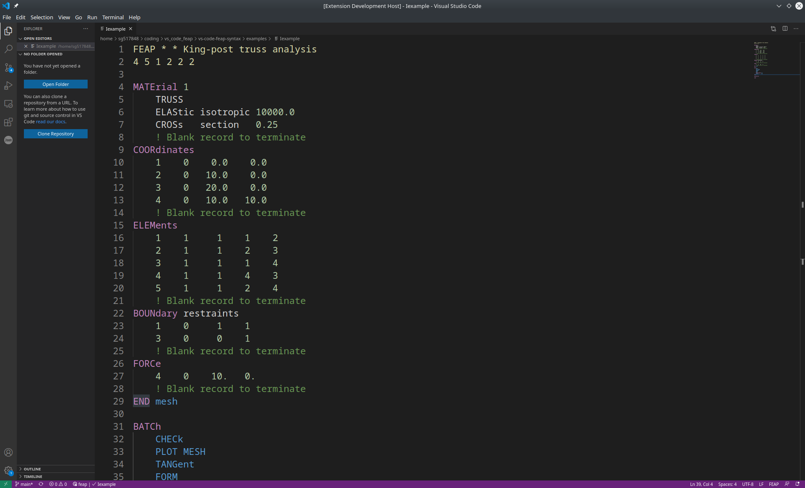

# Basic Syntax highlighting for FEAP input files

A simple [Visual Studio Code](https://code.visualstudio.com/) extension for supporting basic syntax highlighting of [FEAP](http://projects.ce.berkeley.edu/feap/) input files.

**NOTICE:** This extension is still under active development. If you have any suggestions, feature requests, bug reports etc., please open an issue within the [GitHub repository](https://github.com/llamm-de/vs-code-feap.git).

## Issues & Contributions
If you have any issues with this extension, please feel free to report the issue in the [GitHub repository](https://github.com/llamm-de/vs-code-feap.git). If you wish to contribute, feel free to fork and create pull requests.

## License
This software package is distributed under the MIT license. For further details see the [LICENSE.md](LICENSE.md) file.
